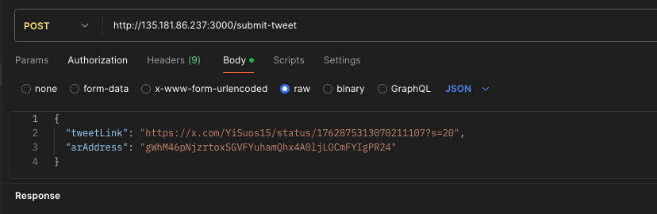

# Apus Bind Twitter

## 项目概述

Apus Bind Twitter 是一个使用 JavaScript 和 SQLite 开发的后端程序。它提供一个 API 接口，用于接收推文链接和 Arweave 地址作为参数，解析推文中的用户名和 Arweave 地址，将数据存储到 SQLite 数据库中，并最终存储到 AO 区块链上。

## 文件结构
```plaintext
apusbindtwitter/
├── config/                    # 配置文件目录
│   └── config.js              # 应用配置文件（如数据库连接、API 密钥等）
├── contract/                  # 智能合约相关文件
│   └── white.lua              # AO 区块链的 Lua 脚本
├── node_modules/              # npm 依赖
├── scripts/                   # 各种脚本文件（如数据库初始化）
│   └── createDatabase.js      # 初始化 SQLite 数据库的脚本
├── src/                       # 源代码目录
│   ├── controllers/           # 控制器，处理 HTTP 请求和响应
│   │   └── tweetcontroller.js # 处理推文提交的逻辑
│   ├── models/                # 数据模型，处理数据库交互
│   │   ├── db.js              # 数据库连接和设置
│   │   └── tweetmodel.js      # 推文数据模型，处理推文数据的保存和查询
│   ├── services/              # 服务层，与外部服务交互
│   │   └── aoService.js       # 与 AO 区块链交互的服务
│   ├── utils/                 # 实用工具函数
│   │   └── parseTweet.js      # 解析推文链接并提取信息的函数
│   └── app.js                 # 应用的入口文件，设置服务器和路由
├── .gitignore                 # Git 忽略的文件和目录
├── package.json               # npm 项目配置文件，定义了依赖和脚本
├── package-lock.json          # 锁定依赖版本的文件
├── README.md                  # 项目说明文件
└── tweets.db                  # SQLite 数据库文件
```

## 初始化数据库

``` node scripts/createDatabase.js```


## 启动服务
```  node src/app.js ``` 

## test demo

